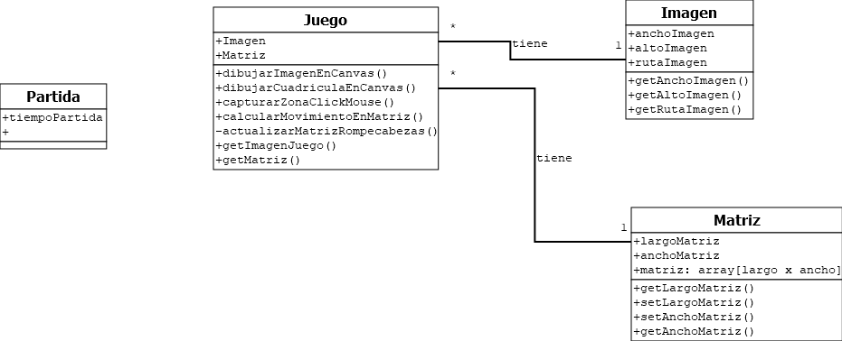

# Proyecto Final de Cursada. 

El desarrollo de la práctica Integradora de la Asignatura Programación en Ambiente Web se basará en el diseño y desarrollo de una Aplicación Web (funcional para navegadores Móvil y de Escritorio).
## Instalacion del Proyecto

[Paso a Paso](Instalacion.md)
## Diagrama UML del Juego

